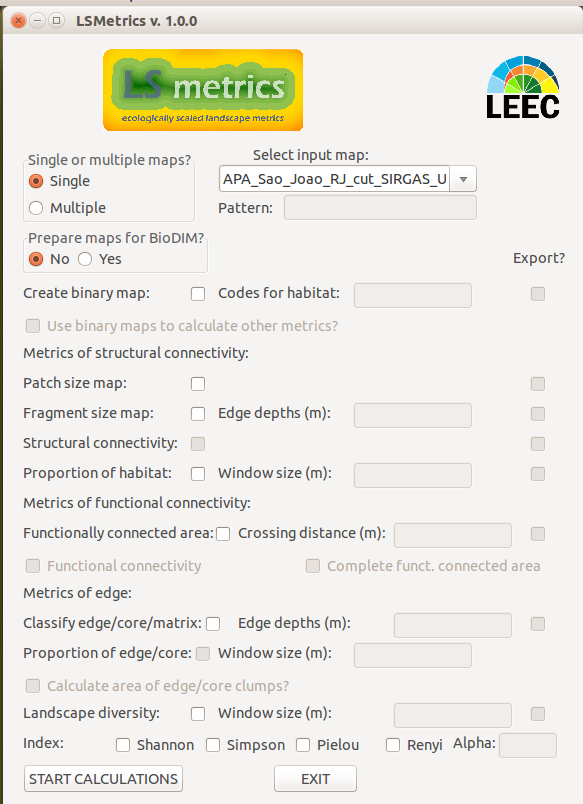

# Landscape Metrics (LSMetrics)

This repository is being used to develop and share LSMetrics package.

LSMetrics is a software designed to calculate ecologically based landscape metrics and landscape statistics, as well as generate maps of landscape connectivity.
Also, the software is designed to prepare maps and enviroment for running BioDIM, an individual-based model of animal movement in fragmented landscapes.
The software runs in a GRASS GIS (currently GRASS GIS 7.x) environment and uses raster images as input.

## Download LSMetrics

First [download the .zip package](https://github.com/LEEClab/LS_METRICS/archive/master.zip) or clone it into your local enviroment using `git`:
```git
# Choose the directory where to clone LSMEtrics
cd path/to/LSMetrics_dir
# Clone it
git clone https://github.com/LEEClab/LS_METRICS.git
```

## Have GRASS GIS installed

LSMetrics runs within GRASS GIS and uses many of its modules and functionalities, so you first need to have GRASS installed in your computer. We recommend you install GRASS version 7.2.x. You can take a look [here](https://github.com/LEEClab/LS_CORRIDORS/wiki/Installation).

## Open or load a GRASS project and import your maps into GRASS

Open GRASS GIS and load or create your project location. If you do not know how to configure a project in GRASS, take a look [here](https://grass.osgeo.org/grass72/manuals/helptext.html). 
After that, you should import your raster maps into GRASS environment. Have a look at [this](https://grass.osgeo.org/grass70/manuals/r.in.gdal.html) and [this](https://grasswiki.osgeo.org/wiki/Importing_data).
**Make sure that your maps (and the GRASS GIS project) are in a projection and a geographic coordinate systems in which 
distances are measured in meters, so that areas and distances are calculated in a meaningful way.**

## Run LSMetrics

Now, it is time to use the app itself. Use the GRASS terminal (the black screen) to start LSMetrics. First change to LSMetrics directory and run it using python:
```bash
# Change to code directory
cd LS_METRICS/_LSMetrics_v1_0_stable

# Run LSMetrics
python LSMetrics_v1_0.py
```

Note: on MS Windows, you may have to change to the partition where the code is located before changing to its directory. E.g.:

```bash
D:
cd "D:/LS_CORRIDORS/_LS_Corridors_v1_0_stable"
```



LSMetrics is currently based on binary (habitat/non-habitat) maps. If your maps are already classified in this fashion, 
you can use it straightforwardly as input to calculate metrics and statistics. If not, first you should select `Create binary map` 
and tell the app which codes correspond to habitat. Then, you can use the resulting map as input to calculate landscape metrics.

LSMetrics is being developed at the Spatial Ecology and Conservation Lab, at Universidade Estadual Paulista, Rio Claro, SP, Brazil.

If you have questions, contact us at one of the e-mails below. You can also contact us if you have any errors running LS Connectivity 
(or you can open an issue here on GitHub).
- Milton C. Ribiero <mcr@rc.unesp.br>
- Bernardo Niebuhr <bernardo_brandaum@yahoo.com.br>
- John W. Ribeiro <jw.ribeiro.rc@gmail.com>

