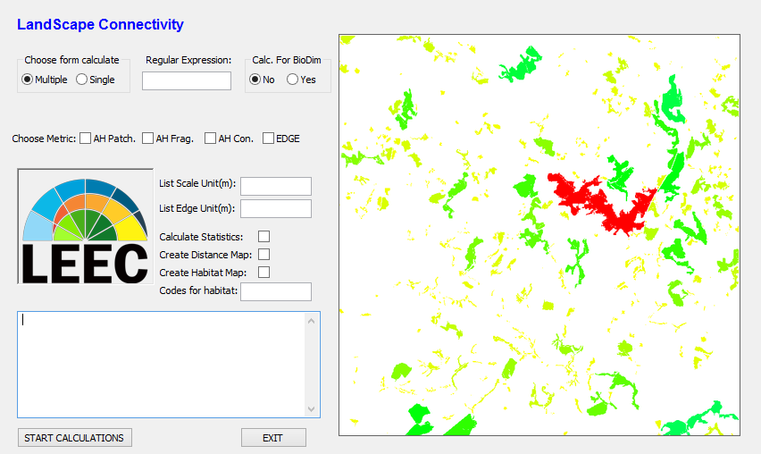

# LandScape (LS) Connectivity

This repository is being used to develop and share LS Connectivity software.

LS Connectivity is a software designed to calculate landscape metrics and landscape statistics, as well as generate maps of landscape connectivity.
Also, the software is designed to prepare maps and enviroment for running BioDIM, an individual-based model of animal movement in fragmented landscapes.
The software runs in a GRASS GIS (currently GRASS GIS 7.0.x) environment and uses raster images as input.

To use it, first download the .zip package or clone it into your local enviroment:
```bash
git clone https://github.com/LEEClab/LS_METRICS.git
```

Open GRASS GIS and load or create your project location. If you do not know how to configure a project in GRASS, take a look [here](https://grass.osgeo.org/grass70/manuals/helptext.html). 
After that, you should import your raster maps into GRASS environment. Have a look at [this](https://grass.osgeo.org/grass70/manuals/r.in.gdal.html) and [this](https://grasswiki.osgeo.org/wiki/Importing_data).
**Make sure that your maps (and the GRASS GIS project) are in a projection and a geographic coordinate systems in which 
distances are measured in meters, so that areas and distances are calculated in a meaningful way.**


Now, it is time to use the app itself. Change to LS Connectivity directory and run it using python:
```bash
cd PROGRAMA_LS_CONECTIVITY
python LS_connectivity_v08_grass7.py
```



LS Connectivity is currently based on binary (habitat/non-habitat) maps. If your maps are already classified in this fashion, 
you can use it straightforwardly as input to calculate metrics and statistics. If not, first you should select `Create habitat map` 
and tell the app which codes correspond to habitat. Then, you can use the resulting map as input to calculate landscape metrics.

LS Connectivity is being developed at the Spatial Ecology and Conservation Lab, at Universidade Estadual Paulista, Rio Claro, SP, Brazil.

If you have questions, contact us at one of the e-mails below. You can also contact us if you have any errors running LS Connectivity 
(or you can open an issue here on GitHub).
- jw.ribeiro.rc@gmail.com
- bernardo_brandaum@yahoo.com.br
- mcr@rc.unesp.br

